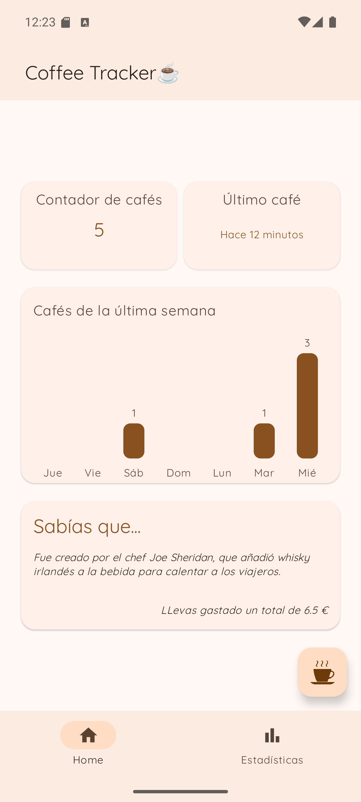
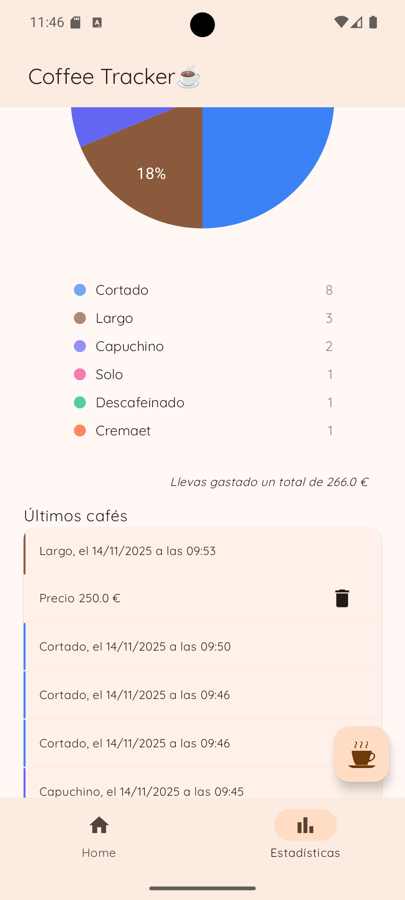
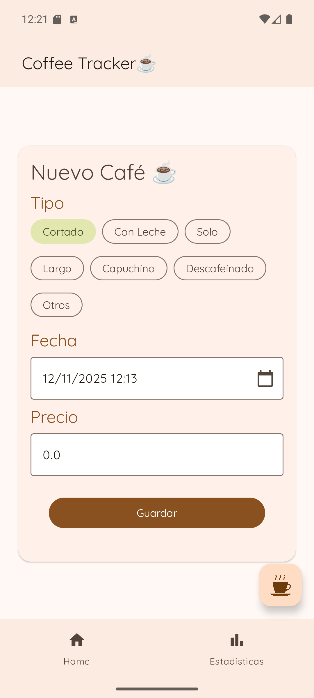

# ☕ Coffee Tracker

---

## 🧩 Descripción

**Coffee Tracker** es una aplicación Android para registrar y analizar tus hábitos de consumo de café.
Su objetivo es ofrecer una experiencia moderna y minimalista para llevar un control detallado de cuántos cafés tomas, qué tipos prefieres y cuándo los consumes.

---

## ✨ Características principales

- ☕ **Registro rápido de cafés**
Añade cafés con un solo toque. Elige entre 8 tipos diferentes.
- 🏠 **Pantalla principal (Home)**
Muestra el contador de hoy, el historial reciente de los últimos 7 días y tiempo desde el último café.

- 🧠 **Arquitectura moderna (MVVM)**  
  Basada en buenas prácticas de Android para garantizar escalabilidad y mantenibilidad.

- 💉 **Inyección de dependencias con Dagger Hilt**

- 🗄️ **Persistencia local con Room Database**

- 🎨 **Interfaz construida en Jetpack Compose (Material 3)**

---

## 🛠️ Tecnologías utilizadas

| Categoría | Tecnología |
|------------|-------------|
| **Lenguaje** | [Kotlin](https://kotlinlang.org/) |
| **UI Toolkit** | [Jetpack Compose](https://developer.android.com/jetpack/compose) |
| **Arquitectura** | MVVM |
| **DI Framework** | [Dagger Hilt](https://dagger.dev/hilt/) |
| **Base de datos local** | [Room](https://developer.android.com/training/data-storage/room) |
| **Navegación** | [Navigation Compose](https://developer.android.com/jetpack/compose/navigation) |
| **Asincronía** | Coroutines + Flow |
| **Estilo visual** | Material Design 3 |

---

## 📱 Capturas de pantalla

| Pantalla principal | Estadísticas | Nuevo Cafe|
|--------------------|-------------------|-------------------|
|  |  |  |

---

## 🧪 Estado del proyecto

🟢 **Versión actual:** `v3.0.0`  
🔧 Proyecto en desarrollo activo.  
Se planifican futuras actualizaciones para:
- Refinamiento visual.
- 🏆 Sistema de logros y retos
- 📊 Nuevas estadísticas
---

## 📝 Licencia

Este proyecto está bajo la licencia **[MIT](https://es.wikipedia.org/wiki/Licencia_MIT)**.  
Puedes usar, modificar y distribuir el código libremente, siempre que se mantenga la atribución correspondiente.

---

## 🤝 Contribuciones

¡Las contribuciones son bienvenidas!  
Si encuentras errores o deseas proponer mejoras, por favor abre un **issue** o envía un **pull request**.

---
## ⭐ Dale una estrella
Si te gusta este proyecto, ¡dale una estrella! ⭐
Ayuda a otros desarrolladores a encontrarlo.

---

## 👨‍💻 Autor

**Juan Gómez**  
Desarrollador Android  

---

> _"El café es el mejor amigo del hombre. Te ayuda a pensar, te mantiene despierto y te da energía." — Desconocido_
